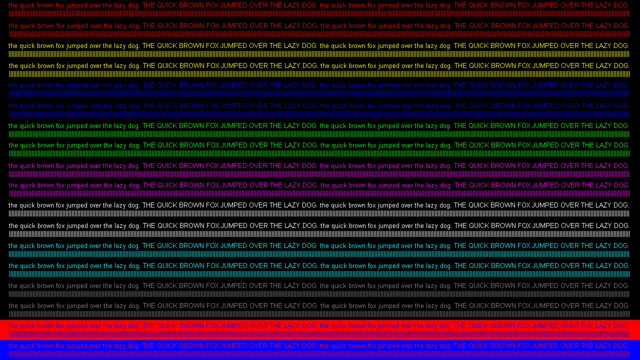
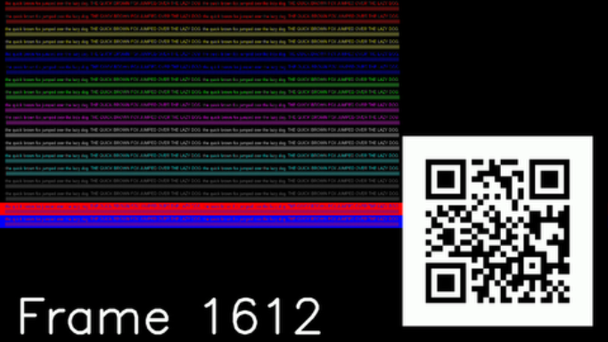
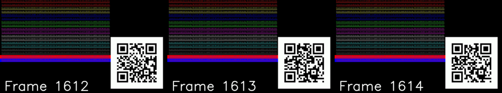

# QR Code Frame Verification

This project generates videos with QR codes embedded in each frame and verifies the presence and order of QR codes in the frames. It is useful for testing frame grabbers and ensuring the integrity of captured frames.

## Table of Contents

- [Requirements](#requirements)
- [Installation](#installation)
- [Usage](#usage)
  - [Generating Videos](#generating-videos)
  - [Verifying Videos](#verifying-videos)
- [Configuration](#configuration)
- [Examples](#examples)
- [Known Issues](#known-issues)
- [License](#license)
- [Author](#author)

## Requirements

- Python 3.x
- OpenCV
- Pillow
- qrcode
- numpy

## Installation

1. Clone the repository:

```bash
git clone https://github.com/your-repo-url.git
cd your-repo-url
```

2. Install the required dependencies:

```bash
pip install -r requirements.txt
```

## Usage

### Generating Videos

To generate videos with QR codes embedded in each frame, run the following script:

```bash
python generate_qr_video.py
```

The script will generate two videos:
- A short video compressed with a lossless codec.
- A longer video compressed with a lossy codec.

The lengths of these videos are configurable within the script. By default, the short video is 5 seconds long and the long video is 10 seconds long. These durations can be adjusted by modifying the constants in the script.

### Verifying Videos

To verify the generated video and check for any missing, repeated, or out-of-order frames, run the following script:

```bash
python verify_qr_video.py
```

The script will analyze the video and save problematic frames in the `problematic_frames` directory. Each problematic frame will be saved along with the previous and next frames for context.

### Example Commands

To generate the videos, you can use the following command:

```bash
python generate_qr_video.py
```

To verify the generated videos, you can use the following command:

```bash
python verify_qr_video.py
```

## Configuration

Both scripts contain configurable constants that allow you to adjust various parameters:

### In `generate_qr_video.py`

- `FPS`: Frames per second for the generated videos.
- `SHORT_DURATION_SECONDS`: Duration of the short video in seconds.
- `LONG_DURATION_SECONDS`: Duration of the long video in seconds.
- `CHROMA_IMAGE_PATH`: Path to the chroma image used as the background.
- `OUTPUT_SHORT_VIDEO_PATH`: Path to save the short video.
- `OUTPUT_LONG_VIDEO_PATH`: Path to save the long video.

### In `verify_qr_video.py`

- `VIDEO_PATH`: Path to the video file to be verified.
- `DUMP_DIR`: Directory to save problematic frames.

You can adjust these constants by modifying their values in the respective scripts.

## Examples

### Frame Layout

Each generated frame has a resolution of 1920x1080 pixels and contains the following elements:
- **Chroma Image**: Placed in the top-left corner with a resolution of 1280x720 pixels.
- **QR Code**: Placed in the bottom-right corner.
- **Frame Number Text**: Placed below the chroma image.

### Chroma Image

The file `chroma-444.png` is used as the background for the generated videos. This image has a resolution of 1280x720 and is used to simulate a typical chroma key background in video production. It looks like this:



### Sample Frame

Here is an example of a single frame with an embedded QR code:



### Problematic Frame Set

In case of detection issues, the script saves the problematic frame along with the previous and next frames for context. Here is an example of such a set:



## Known Issues

- **QR Code Detection**: Sometimes, the QR codes may not be detected in certain frames, even though they are present and clear. This can be due to the compression artifacts in the video or limitations in the QR code detection algorithm.
- **Missing Frames**: If a QR code is not detected in a frame, the script may mark it as missing. This can lead to false positives in the detection of missing frames.
- **Repeated and Out-of-Order Frames**: The script attempts to identify repeated and out-of-order frames. However, inaccuracies in QR code detection can lead to incorrect classifications.
- **Frame Numbering**: The QR codes embedded in the frames include frame numbers, which are used for verification. If the frame numbers are not detected correctly, it can result in incorrect reporting of issues.

These issues are inherent to the limitations of current QR code detection algorithms and video compression artifacts. Further improvements and alternative methods for frame verification are being explored.

## License

This project is licensed under the MIT License. See the [LICENSE](LICENSE) file for details.

## Author

Miklesz / Damage

**Inspirations:**

- Argasek / Aberration Creations ^ DCR ^ IPL
